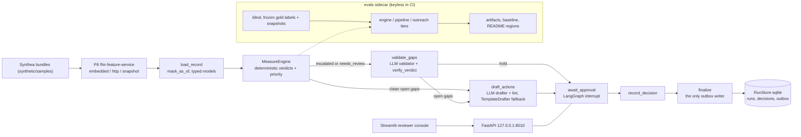
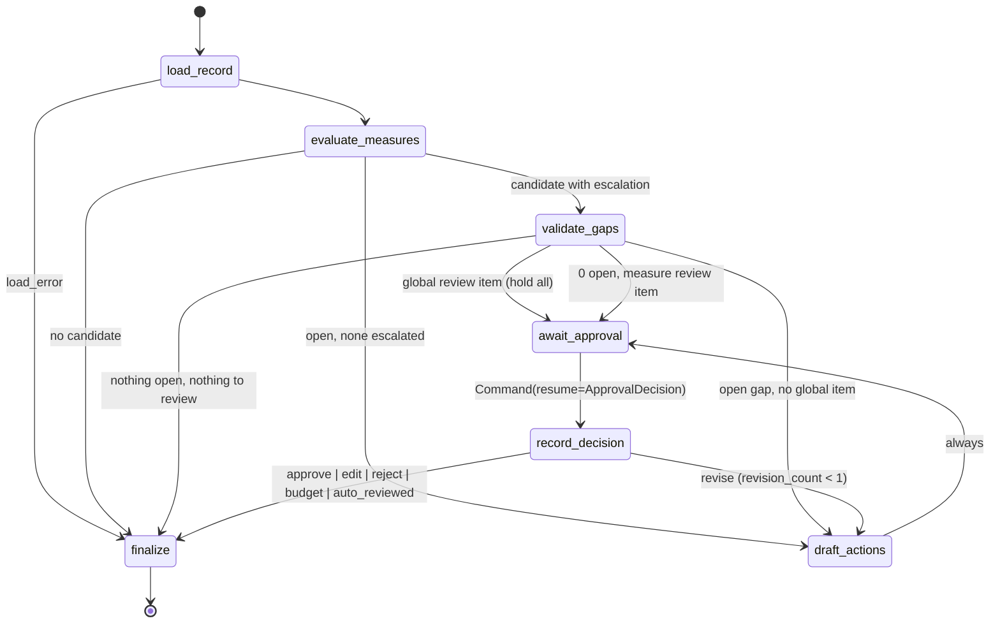

# hedis-care-gap-agent

LangGraph care-gap closure over synthetic (Synthea) patients. A deterministic, HEDIS-aligned
measure engine decides denominator, numerator, coded exclusions, escalation flags, verdict and
priority for eight measures; an LLM validator acts only on escalated candidates and only in ways
code can verify; an LLM drafter writes outreach language that code lints; and a checkpointed
LangGraph interrupt puts a stored human decision structurally in front of the outbox. Records
come from the sibling [fhir-feature-service](https://github.com/thiagobandeira1/fhir-feature-service)
(P6); the eval harness is the sibling [clinical-agent-evals](https://github.com/thiagobandeira1/clinical-agent-evals) (P5).

**What it is not.** Demo-grade; HEDIS-aligned; not NCQA-certified. The rules are public-source
approximations (CMS Star Ratings Technical Notes wording plus explicitly tagged demo choices),
not NCQA specifications. Every patient is synthetic; no real or de-identified clinical data is
used anywhere. Nothing here is a certified quality-measurement product or medical advice.

The contract is [`docs/SPEC.md`](docs/SPEC.md); the decisions are in [`docs/adr/`](docs/adr/README.md);
the generated rule text with citations is [`docs/MEASURES.md`](docs/MEASURES.md); the eval
protocol is [`evals/README.md`](evals/README.md).

## Architecture



The per-patient state machine, verbatim from `docs/SPEC.md` section 3. A test asserts that its
node set and edge set equal the compiled graph, that `await_approval` is the only node calling
`interrupt`, and that `finalize` is the only node touching the outbox
(`tests/unit/graph/test_structure.py`).



Verdicts come from one function over three-valued logic (`caregap.measures.tri.resolve`):
denominator `no` is `not_eligible`, `unknown` is `needs_review`; a coded exclusion is
`excluded`; numerator `yes` is `closed`, `unknown` is `needs_review`, else `gap_open`; any
escalation promotes `gap_open` or `closed` to `needs_review`. Priority is
`star_weight x clinical_weight x time_pressure`, ranked by code.

## Measures

Measurement year (MY) = the calendar year of `as_of`; age = age at December 31 of the MY;
denominator and exclusion windows use MY bounds; every numerator window ends at `as_of`.
Global rules: death before the MY is `not_eligible`; death or hospice inside `[MY start, as_of]`
is `excluded`; hospice before the MY is never an exclusion (only E1). Full element tables with
citations: [`docs/MEASURES.md`](docs/MEASURES.md).

| ID (Star) | Denominator (demo) | Gap closes when | Key demo choices | Escalations |
|---|---|---|---|---|
| CBP (C14) | 18-85, hypertension active in MY | most-recent BP panel in MY has SBP < 140 and DBP < 90 | panel = LOINC 85354-9 with both children, mm[Hg], not IMP/EMER; lowest same-date readings; no panel in MY is `no_bp_in_my`; dialysis and kidney transplant treated as ESRD-equivalent | E1 E4 E5 E6 |
| EED (C11) | 18-75, diabetes active in MY or prior year | retinal exam in MY, or in MY-1 with a negative retinopathy answer and no retinopathy dx by then | prediabetes never qualifies | E1 E4 E6 |
| BCS (C01) | female 52-74 | mammogram in `[Oct 1 MY-2, as_of]` | 27-month window; bilateral mastectomy not representable | E1 E4 |
| COL (C02) | 50-75 | colonoscopy in `[Jan 1 MY-9, as_of]` or FOBT/FIT in MY | sigmoidoscopy, CT colonography, sDNA not representable; colorectal cancer any time excludes | E1 E4 E7 |
| SPC (C19) | male 21-75 / female 40-75 with ASCVD onset by MY end | moderate- or high-intensity statin on therapy in MY | on-therapy reads `MedicationRequest.status` (ADR-0002); low-intensity only is `low_intensity_only`; intensity from the public ACC/AHA table | E1 E3 E4 |
| SPD (D12) | 40-75, diabetes as EED, not in the SPC denominator | any-intensity statin on therapy in MY | diagnosis-based proxy for a Part D fill measure; one statin gap per member | E1 E3 E4 |
| TSC (none) | 18+ with an encounter in MY | LOINC 72166-2 with a coded answer in MY | screening only, no cessation component; counts-only in evals | E1 E4 |
| SNS (none) | 18+ with an encounter in MY | LOINC 93025-5 PRAPARE observation in MY | one screening event, not per domain; counts-only in evals | E1 E4 |

Escalations hold a patient for a human and are never computed as exclusions: E1 (global) a
hospice event within 90 days before the MY; E3 a statin authored in the MY with status stopped or
cancelled; E4 (global) dementia plus inpatient/ED care in the MY at 66+; E5 a BP panel missing a
child or with a non-mm[Hg] unit; E6 the qualifying condition abated inside the MY; E7 an
ambiguous colon code (possible colectomy or cancer). There is no E2: the vocabulary is E1 and
E3–E7.

## How the guardrails are enforced

- **Keyless CI.** `.github/workflows/ci.yml` runs ruff, mypy, pytest, the engine eval gate and
  `caregap report --check` with no secret configured. `tests/conftest.py::pytest_sessionstart`
  aborts the session if `CAREGAP_ANTHROPIC_API_KEY` or `ANTHROPIC_API_KEY` is set.
  `caregap.llm` is the only module importing `langchain_anthropic`, and `anthropic_bundle` is
  the only code that reads the key; every graph path in tests runs under fakes or replays
  through the same `StructuredCaller` parser as the real models.
- **Allowlist logging.** `caregap.logging_setup.ALLOWED_KEYS` drops every log field that is not
  an id, node name, status, duration, count, model id, prompt sha or error class. No record
  content, dates, display strings or outreach text can be logged.
- **No PHI, synthetic only.** Only Synthea personas (`synthetic/samples`) and P6 snapshots of
  them are committed; `.gitignore` blocks `data/`, databases, CSV/parquet and `.env`, and CI
  fails if any such file is tracked. `PatientHeader` keeps birth date, death date and sex only;
  race, ethnicity and address never enter the process. The validator sees an allowlist
  projection of the record inside a fenced data block; the drafter sees an age band, sex,
  chronic flags and counts, never a name.
- **Public-source rule text.** Quoted sentences come only from the CMS 2026 Part C & D Star
  Ratings Technical Notes (US-government public domain) via P2's committed corpus;
  `scripts/sync_rule_text.py` asserts every quote is a verbatim substring of the cited page.
  NCQA measure summaries, eCQI pages and the ACC/AHA guideline are cite-only: nothing is quoted
  from them. Every rule element is tagged `quoted`, `demo_choice` or `not_representable`.
- **Value-set provenance.** Sources are allowlisted; every code in a P1 set appears in the
  committed 237-bundle scan (`src/caregap/measures/value_sets/SCAN.md`) or is flagged
  `untested_by_data`; P6's sets are vendored and parity-tested against the installed package.
- **Structural HITL.** No outreach reaches the outbox without a stored decision: `finalize` is the
  only writer, `OutboxEntry.approval_ref` is required, the ledger is UNIQUE on decision id and on
  (thread, action), and `approval_mode=auto` (evals) is never actionable. See ADR-0003.

## Quickstart (keyless, under ten minutes)

```bash
uv sync
uv run caregap bootstrap                       # Synthea samples -> data/p6.duckdb through P6's own CLI
uv run caregap panel --as-of 2026-06-30        # engine verdict counts per patient, no models
uv run caregap run --patient <id> --as-of 2026-06-30 --models replay
uv run caregap serve                           # FastAPI on 127.0.0.1:8010
uv run caregap ui                              # Streamlit console (talks only to the API)
```

`caregap run` prints the pending `ApprovalRequest` and the `POST .../decision` call that resumes
it; `caregap serve` shares the same sqlite checkpoint and ledger paths, so the decision can be
made from the API or the UI. Without recordings, `--models replay` falls back to deterministic
sentinels: the validator routes to human review and the drafter uses the template. Real models
run only when `CAREGAP_MODELS=anthropic` and a key is present in `.env` (see `.env.example`).
Other commands: `caregap eval --tier engine|pipeline|outreach [--record|--judge|--regen|--gate|--update-baseline]`
and `caregap report [--check]`.

## API and UI

FastAPI (`caregap.api.app:create_app`, RFC 9457 problem details, sync routes because embedded P6
runs behind a Starlette test client): `GET /healthz`, `GET /v1/measures` (tagged rule text and
coverage), `GET /v1/panel`, `GET /v1/patients/{id}/gaps?as_of=` (engine only, nothing persisted),
`POST /v1/runs` (202, sequential background loop, cap 50 patients), `GET /v1/runs/{id}`,
`POST /v1/runs/{id}/cancel`, `GET /v1/runs/{id}/patients/{pid}` (pending request derived from
the checkpoint), `POST /v1/runs/{id}/patients/{pid}/decision` (validate then resume; 404 / 409 /
422; a repeated `decision_id` replays the stored result), `GET /v1/approvals`, `GET /v1/outbox`.

The Streamlit console (`caregap ui`) has three pages: Panel (start a run, follow the stepper,
cancel), Patient (verdict chips, evidence and coverage tables, validator cards, review items,
the drafted plan, and the approval card with approve, edit and approve, request revision, and
reject), and Outbox & audit. A persistent demo-grade banner is shown; the UI never computes.

## Evaluation

> The headline precision/recall measures the deterministic engine (plus code-verified validator decisions) against demo-grade rules applied by a blind labeler (an LLM working from worksheets, independent of the engine; human spot-check pending); it is independent of the drafting agent. Agents are measured separately.

<!-- EVAL:BEGIN -->
| Metric | Engine-only |
|---|---|
| micro_f1 | 1.000 |
| micro_precision | 1.000 |
| micro_recall | 1.000 |

_Stamps: config_hash=66da144d516d2df64719492bb3793848449f97361a96b0a639c20b9218f6ea5a · dataset_hash=241ae473bf579ef465aee8b1642ec566d4a32565ee733f3690d22ae1890b53ef_
<!-- EVAL:END -->

<!-- EVAL-MEASURES:BEGIN -->
| measure | n_test | tp | fp | fn | precision | recall | f1 |
|---|---|---|---|---|---|---|---|
| CBP | 43 | 2 | 0 | 0 | insufficient | insufficient | insufficient |
| EED | 43 | 5 | 0 | 0 | 1.000 | 1.000 | 1.000 |
| BCS | 43 | 12 | 0 | 0 | 1.000 | 1.000 | 1.000 |
| COL | 43 | 7 | 0 | 0 | 1.000 | 1.000 | 1.000 |
| SPC | 43 | 0 | 0 | 0 | insufficient | insufficient | insufficient |
| SPD | 43 | 2 | 0 | 0 | insufficient | insufficient | insufficient |

_Source: engine-latest.json (Engine-only, test split) · outcomes_sha256=d5b788978c44 · gold_sha256=241ae473bf57_
_Publication guard: insufficient test gold-open units for CBP, SPC, SPD (guard: n >= 5 per measure, BCS >= 3); the headline is provisional._
_Strict variant (needs_review counts as no gap): micro_f1=1.000 · micro_precision=1.000 · micro_recall=1.000_
_Pipeline tier (Engine+validator): unpublishable — 52 model call(s) had no recording (fallback sentinels); engine-only numbers are shown._
_Outreach faithfulness (LLM judge): not yet measured._
<!-- EVAL-MEASURES:END -->

Both regions above are rewritten by `caregap report` from the latest artifacts and checked in
CI; no number in this file is typed by hand. The design, in short (full protocol in
[`evals/README.md`](evals/README.md)):

- Unit = (patient, core measure) at `as_of = 2025-12-31`. A predicted gap is a final status of
  `gap_open` or `needs_review`; gold `open` is a gap; gold `escalate` is scored only by whether
  the pipeline held the measure for a human; a patient run that errors counts as missed.
- Gold labels are produced by a blind LLM labeler applying the written demo rules to
  value-set-agnostic worksheets, split by `sha256(patient_id)` (one third dev, two thirds test),
  and frozen with a hash before any engine contact; a second labeler covers a 12-patient subset;
  a human spot-check is pending.
- Three tiers: `engine` (CI-live, byte-diffed against committed outcomes; the engine-only column),
  `pipeline` (replayed validator and drafter recordings; refuses an unfrozen or changed gold set;
  unpublishable when any call had no recording), `outreach` (a frozen faithfulness rubric judged
  locally, re-parsed keylessly in CI).
- Six ratchet-gated metrics with a 0.02 tolerance; per-measure rows publish only with at least
  five test gold-open units (three for BCS); TSC and SNS are counts, never ratios.
- How to read a perfect score: the labeler applied a guide written from the same rule JSON and
  public code lists the engine implements, so the test-split numbers measure whether the code
  does what the written rules say over 60 synthetic patients (258 test units, 28 gold-open) —
  not clinical validity, and not robustness to data the rules never anticipated. Both labelers
  are the same model family, which inflates their agreement. The interesting evidence is in
  `evals/gold/CODE_AUDIT.md` (events the labeler flagged as matching a concept outside the listed
  codes) and `evals/gold/ADJUDICATION.md`.

## Repository layout

```
src/caregap/          config, llm (only Anthropic import), fakes, structured, logging_setup, runtime, cli, evalrun
  p6/                 client protocol + errors + mask_as_of, http, embedded, snapshot, models
  measures/           ids, context, windows, tri, evidence, engine, priority, value_sets, rule_text,
                      rules/{cbp,eed,bcs,col,spc,spd,screening,global_rules}.py + rules/json/, value_sets/*.json + SCAN.md
  agents/             schemas, prompts (frozen, sha-stamped), packet, validator, drafter, template_drafter
  graph/              state, nodes, edges, build, hitl, runstore, outbox, runner
  api/                app, deps, errors, schemas, routes_*
  ui/                 app, client, components
  evals/              gold, scoring, gates, rubrics, outcomes            (code; data lives under evals/)
evals/                gold/ (labels, freeze, snapshots), recorded/, artifacts/, baseline.json, README.md
synthetic/            samples/ (Synthea personas), p6_snapshots/ (committed P6 responses + MANIFEST)
scripts/              scan_codes, sync_rule_text, gold (snapshot | goldens), freeze_gold
docs/                 SPEC, PLAN, MEASURES (generated), REVIEW_BACKLOG, adr/
tests/                unit/{measures,agents,graph,p6,api,ui,evals}, factories, conftest (key guard)
```

## Relation to the sibling repositories

- [fhir-feature-service](https://github.com/thiagobandeira1/fhir-feature-service) (P6, pinned
  `v0.1.0`): Synthea ingestion, canonical patient records, features and value sets. This
  repository consumes it over HTTP, embedded in-process, or from committed snapshots (ADR-0004);
  P6 delegates measure logic here.
- [clinical-agent-evals](https://github.com/thiagobandeira1/clinical-agent-evals) (P5, pinned
  `v0.1.0`): dataset loading, confusion scoring, artifacts, ratchet gates, the faithfulness
  rubric and judge parsing, README region sync.
- [hedis-spec-copilot](https://github.com/thiagobandeira1/hedis-spec-copilot) (P2): the committed
  public-domain corpus of the CMS 2026 Star Ratings Technical Notes from which every quoted rule
  sentence is drawn.

## License

MIT. See [`LICENSE`](LICENSE). Synthetic data only; demo-grade; HEDIS-aligned; not NCQA-certified.
