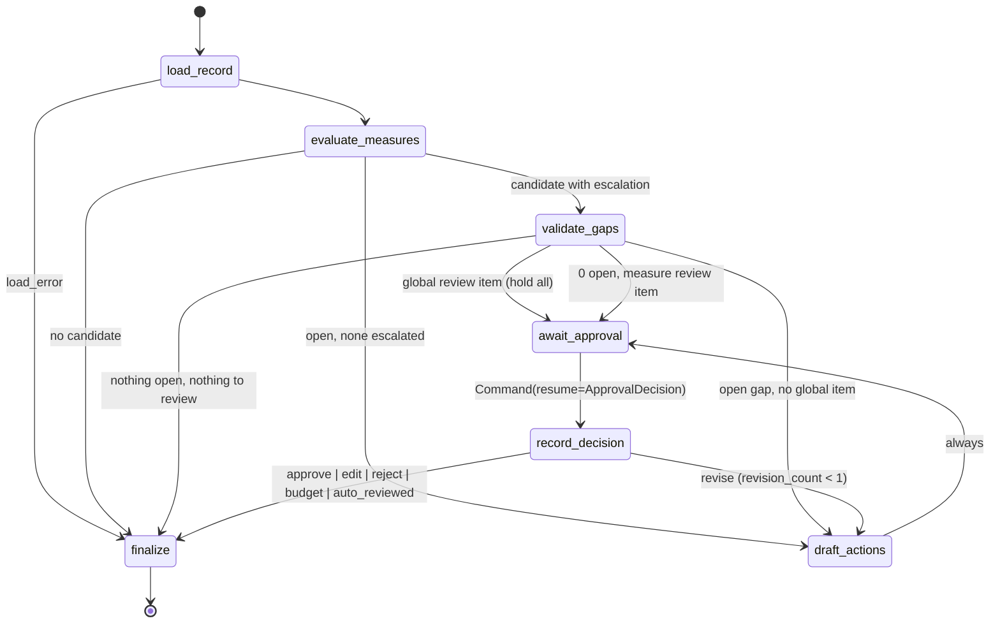

# SPEC — hedis-care-gap-agent (P1, flagship)

> Status: **approved v1** · Package `caregap` · Produced by a 3-lens design panel (agent
> architecture, clinical measures, eval/product) + adversarial critiques + synthesis, on top of
> the shipped P6 (`fhir-feature-service@v0.1.0`) and P5 (`clinical-agent-evals@v0.1.0`).
> Decisions are recorded in `docs/adr/`. **Demo-grade, HEDIS-aligned, not NCQA-certified.**

## 1. Purpose

A LangGraph state machine per (patient, as_of):
`load_record → evaluate_measures (deterministic engine) → validate_gaps (LLM, escalated
candidates only) → draft_actions (LLM) → await_approval (interrupt) → record_decision →
finalize (outbox)` — typed state, conditional edges, checkpointed interrupt/resume, and a
**structural guarantee that no outreach reaches the outbox without a stored human decision.**

P6 ADR-0005 delegates measure logic to P1: a deterministic `MeasureEngine` owns denominator,
numerator, coded exclusions, coverage, escalation flags, verdict, and priority. LLMs are
**monotonic**: the validator may only `confirm_open | exclude | numerator_met | needs_human`
(all code-verified); the drafter writes language only; rank/priority are deterministic.

Data: **Synthea only** (no MIMIC anywhere). Cloud LLMs (claude-sonnet-5 agents, claude-opus-5
judge) only in explicit local runs; **CI is keyless** — every graph path runs under injected
fake/replay models.

## 2. Measures (demo-grade rules; `src/caregap/measures/rules/json/<id>.json`)

Every rule element is tagged `quoted | demo_choice | not_representable` with public-source
citations (CMS 2026 Star Ratings Technical Notes via P2's committed corpus; public NCQA/CMS
summaries by URL; the public ACC/AHA statin-intensity table). Age = age at Dec 31 of the
measurement year (MY). Numerator windows end at `as_of`; denominator/exclusion windows use MY
bounds. `clinical_status`/`verification_status` never consulted; `MedicationRequest.status`
read ONLY for the statin on-therapy rule and the E3 conflict flag (ADR-0002).

| ID | Denominator | Numerator (window ends at as_of) | Coded exclusions | Escalations |
|---|---|---|---|---|
| **CBP** (C14) | 18–85; hypertension condition onset ≤ my_end, abatement null or > my_start | most-recent-date BP panel in MY: parent 85354-9 with BOTH 8480-6/8462-4 children sharing `parent_observation_id`, unit mm[Hg], encounter class not IMP/EMER; representative = lowest SBP and lowest DBP among same-date panels; met iff SBP<140 and DBP<90; none in MY → open `no_bp_in_my` | death/hospice in MY; ESRD dx (quoted); dialysis (demo); pregnancy in MY; kidney transplant (demo) | E1, E4, E5 incomplete panel/unit, E6 htn abated in MY |
| **EED** (C11) | 18–75; diabetes active in MY or prior year (prediabetes never) | retinal exam in MY; OR in MY-1 with negative retinopathy answers (71490-7/71491-5 = LA18643-9) and no retinopathy dx ≤ exam (demo) | death/hospice | E1, E4, E6 |
| **BCS** (C01) | female 52–74 | mammogram in [Oct 1 MY-2, as_of] (27-month, demo) | death/hospice; bilateral mastectomy (`not_representable`) | E1, E4 |
| **COL** (C02) | 50–75 | colonoscopy 73761001 in [Jan 1 MY-9, as_of] OR FOBT/FIT (57905-2 obs / 104435004 proc) in MY; sigmoidoscopy/CT/sDNA `not_representable` | death/hospice; colorectal cancer any time (quoted); total colectomy (`not_representable`) | E1, E4, E7 ambiguous colon code |
| **SPC** (C19) | male 21–75 / female 40–75; ASCVD condition onset ≤ my_end | ON THERAPY in MY: statin RxNorm with moderate/high intensity, authored in MY OR authored earlier with `status == active`; stopped/cancelled never count; low-only → open `low_intensity_only` | death/hospice; ESRD/dialysis in MY or prior year; pregnancy; cirrhosis/myopathy (`not_representable`) | E1, E4, E3 medication_status_conflict |
| **SPD** (D12-style) | 40–75; diabetes as EED; not in SPC denominator (product choice: no double outreach) | ON THERAPY as SPC, any intensity | death/hospice; ESRD/dialysis | E1, E4, E3 |
| **TSC / SNS** (MY2026-style screening, one shared rule) | 18+ with ≥1 encounter in MY | 72166-2 with non-null value_code in MY / 93025-5 PRAPARE in MY | death/hospice | none |

Global rules: `death_date < my_start` → not_eligible; `my_start ≤ death_date ≤ as_of` →
excluded (quoted); hospice in [my_start, as_of] → excluded; hospice before MY is
**deterministically not** an exclusion (public text says "during the measurement period";
32% of living Synthea patients carry prior hospice codes) — only a hospice event within 90
days before my_start raises **E1 (global)**. Dementia dx/meds + inpatient/ED in MY at 66+
raises **E4 (global)**; never computed as an exclusion.

Verdict algebra (one exhaustively tested function over Tri³): denominator no → `not_eligible`;
unknown → `needs_review`; definite exclusion → `excluded`; numerator yes → `closed`; unknown →
`needs_review`; else `gap_open`; any escalation whose resolution could flip the verdict promotes
to `needs_review`. Escalations E1–E7 are enumerated. Coverage tables list every public exclusion
criterion as observable/partial/not_representable (UI card + `/v1/measures`).

Priority: `score = star_weight × clinical_weight × time_pressure`; star 3 for CBP else 1;
clinical CBP 3, SPC 3, SPD/EED/COL/BCS 2, TSC/SNS 1 (+1 for CBP `no_bp_in_my` / SPC
`low_intensity_only`); `time_pressure = 1 + (1 − days_to_my_end/365)` (1 for retrospective).
Rank by code, ties by measure id.

Value sets: P6's five files vendored (parity test vs installed P6) plus P1 sets (hospice,
ESRD, dialysis, kidney transplant, colorectal cancer, ambiguous colon, pregnancy (+trap),
dementia (+meds), diabetic retinopathy, retinopathy-negative LOINC, prediabetes trap, SDOH
LOINC, tobacco answers, `statin_intensity.json` per the public ACC/AHA table) — every code
present in the committed `SCAN.md` (300-bundle scan) or marked `untested_by_data`.

Eval anchor `as_of = 2025-12-31` (complete MY2025); demo anchor `2026-06-30`.

## 3. State machine (`src/caregap/graph/`)

- `GapState` TypedDict (run_id, patient_id, as_of, options, record, features, context,
  evaluations, verdicts⊕, open_gaps, review_items, plan, draft_error, revision_feedback⊕,
  revision_count, decision, decisions⊕, agent_errors⊕, outcome, trace⊕) with frozen pydantic
  payloads (`MeasureEvaluation`, `ValidationVerdict`, `CareActionPlan`, `ReviewItem`,
  `ApprovalRequest`, `ApprovalDecision`, `RunOutcome`, `EvidenceRef`).
- `GraphDeps` frozen dataclass: `p6, models, engine, run_store, outbox, structured`.
- **`await_approval` is the only node calling `interrupt`**, does no I/O or model call, never
  writes status (LangGraph discards an interrupting node's writes); pending is derived from
  `graph.get_state`. `finalize` is the only outbox writer (approval_ref required, idempotent by
  action_id). Tests assert both structurally (AST/graph inspection) and the README mermaid
  node set equals the compiled graph.
- HITL: `ApprovalDecision(action ∈ approve|edit|revise|reject|auto_reviewed, decision_id
  UNIQUE, edited_plan re-linted, feedback required for revise, review_resolutions with reasons;
  a resolution to OPEN must be a `revise` → 422 otherwise)`. `approval_mode=auto` (evals) emits
  the request, records `auto_reviewed`, `actionable=False`, never writes the outbox.
  Supersession marks stale pending requests when a newer run finalizes the patient.
- Checkpointers: `MemorySaver` (tests/CI/evals/CLI); `SqliteSaver` at `data/checkpoints.sqlite`
  (API/UI, single writer, WAL). Per-patient timeout 120 s; run cap 50; cancellation flag.
- Structured outputs: `StructuredCaller.call(model, schema, *, system, user, case_key)` =
  `invoke → clinevals.extract_json_object → model_validate`, one correction turn, then
  `AgentOutputError` → fail closed (validator: `needs_human` review item; drafter:
  `TemplateDrafter` + `draft_error`). Same path for real, fake, replay, recording models.
  `ReplayChatModel` keyed by `case_key = role:patient:measure|plan:as_of:revision`; fallback
  mode returns deterministic sentinels and stamps `fallback_count` (blocks publication of the
  pipeline column when > 0).

## 4. Agents

- **Validator** — input: code-built `EvidencePacket` (rule elements with citation ids,
  context, engine findings, evidence table of ids/codes/dates/status — no names, no
  addresses, display strings in a fenced data block). Output `ValidationVerdict`;
  `verify_verdict` (code): evidence ids must resolve; `exclude` needs a listed category and
  in-window evidence of that set; `numerator_met` needs a numerator-set event in window; low
  confidence → needs_human; a verdict on a `closed` candidate can only be needs_human; can
  never add a gap. Failures → `ReviewItem(reason="validator_failed")`.
- **Drafter** — input: open gaps (plain names, decisive dates, rank, subtype), measure review
  items ("do not draft for these"), context (age band, sex, chronic flags, encounters,
  positive SDOH domains, clinic name/phone), feedback, style guide (grade-8, generic
  salutation, no undisclosed diagnoses, no dose instructions, no codes, opt-out line). Output
  `CareActionPlan`; `lint` (code): gap-id set equality, no codes/event ids in the patient
  message, numbers ⊆ evidence numbers, forbidden phrases, "cancer" only in screening phrases,
  length caps; rank/action_id overwritten by code. One regeneration, then `TemplateDrafter`.
- **Judge** (evals only): `clinevals.faithfulness_rubric("Medicare Advantage HEDIS-aligned
  care-gap outreach", name="caregap-faithfulness-v1")` over provider note + patient message
  vs evidence lines; claude-opus-5 locally, recorded to `evals/recorded/judge.jsonl`,
  re-parsed keylessly; 12-item human spot-check via `stratified_sample` + `agreement_rate`.

## 5. P6 integration (`src/caregap/p6/`)

`P6Client` Protocol (`healthz, features_schema, list_patients, get_record(to=as_of),
get_features(as_of)`), two implementations: `HttpP6Client(httpx.Client)` — one code path for
http mode (`fhir-features serve`) and **embedded mode** (Starlette `TestClient` over
`fhir_features.api.app.create_app(...)` entered once in P1's lifespan, so all P6/graph routes
are sync `def`); `SnapshotP6Client(dir)` over committed `synthetic/p6_snapshots/<pid>/
record_2025-12-31.json.gz` + features + MANIFEST (unit/graph/eval tests, zero DuckDB).
Typed models with `extra="ignore"`; `PatientHeader` keeps birth/death/sex only (race/
ethnicity/address dropped at the boundary); `mask_as_of` nulls future death/abatement/end
dates. Errors: 404 → `PatientNotFound`; 422/schema → `P6ContractError`; connection/5xx after
3 retries → `P6Unavailable` → `load_error`. Features never feed the engine (import guard test).
`caregap bootstrap` ingests personas in-process via P6's CLI (`FF_DB_PATH=data/p6.duckdb`),
bypassing the 20 MB HTTP cap; bundles slimmed by `scripts/slim_bundle.py` (types P6 skips)
with an equality test.

## 6. Eval design (`evals/`, only datasets/items/validators/scoring/rubric/gates/baseline)

Unit = (patient, core measure). `predicted = {"gap"}` iff final status ∈ {OPEN,
NEEDS_REVIEW}; gold `open` → `{"gap"}`; `escalate` gold → `counts=None` (scored by
`review_flagged`); error patients → FN. Engine-only column = same score_fn over
`validation_mode=off`; `validator_unsafe_close` (lower-is-better) = gold-open items the
validator excluded/closed. Headline micro P/R/F1 = `report.test_overall` over six core
measures; TSC/SNS as counts only; strict variant in the artifact; publication guard: per-measure
test gold-open n ≥ 5 (BCS ≥ 3).

Gold protocol (solo, blind, frozen): rule JSON + `LABELING_GUIDE.md` first → feasibility
scan → stratified selection on descriptive facts (never engine verdicts; ≥8 eligible per
measure, ≥12 no-gap probes, ≥6 escalation carriers; 60 patients) → snapshots (all observation
codes) → value-set-agnostic blind worksheets (import-guard test) → labels
`gap_cases.jsonl` → split `sha256(patient_id)` 1/3 dev, 2/3 test → **freeze + hash before
engine contact** → adjudication on dev only (`ADJUDICATION.md`; test labels frozen, change count
published) → ≥24 h self-agreement re-label on 12 patients (or honest "pending").

Tiers: `caregap eval --tier engine` (CI live; byte-diff vs committed `engine-outcomes.jsonl`),
`--tier pipeline` (CI replay, `approval_mode=auto`, refuses on hash mismatch, stamps
`fallback_count`), `--tier outreach` (local `--judge`; CI re-parses recordings). Artifacts via
`clinevals.build_artifact/write_artifact`; README `EVAL` region via `sync_readme(comparison=
("Engine-only", "engine_only_overall"), primary_label="Engine+validator")` plus a P1
`EVAL-MEASURES` counts table (`measure | n_test | tp | fp | fn | precision | recall | f1`).
Gates: `micro_precision`, `micro_recall`, `engine.micro_precision`, `engine.micro_recall`,
`validator_unsafe_close↓`, `unresolved_evidence↓`; tolerance 0.02; HITL properties are hard
tests. Judge–human agreement < 0.80 → untrusted banner.

Headline honesty statement (README, verbatim): *"The headline precision/recall measures the
deterministic engine (plus code-verified validator decisions) against demo-grade rules applied by a blind labeler (an LLM working from worksheets, independent of the engine; human spot-check pending); it is independent of the drafting agent. Agents are measured separately."*

## 7. API, UI, CLI

FastAPI (`127.0.0.1:8010`, RFC 9457, sync routes): `/healthz`, `/v1/measures`, `/v1/panel`,
`/v1/patients/{id}/gaps`, `POST /v1/runs` (202, background sequential loop), `/v1/runs/{id}`,
`POST .../cancel`, `/v1/runs/{id}/patients/{pid}`, `POST .../decision` (validate → resume;
404/409/422 semantics; duplicate decision_id → stored result), `/v1/approvals`, `/v1/outbox`.
`RunStore` sqlite (runs, patient_runs, decisions UNIQUE, outbox UNIQUE(thread, action)).
Streamlit (`caregap ui`): Panel (as_of, run, stepper), Patient (verdict chips, evidence,
coverage, validator cards, **approval card** with approve / edit & approve / request revision
/ reject), Outbox & audit; persistent demo-grade banner; the UI never computes.
CLI: `bootstrap`, `panel --as-of`, `run --patient --as-of [--models fake|replay|anthropic]
[--approve interrupt|auto]`, `serve`, `ui`, `eval --tier … [--record|--judge|--regen|
--update-baseline] | readme [--check]`; `scripts/gold.py select|snapshot|worksheet`.

## 8. Module layout

`src/caregap/`: `config.py llm.py fakes.py structured.py logging_setup.py evalrun.py cli.py`
· `p6/` {client, http, embedded, snapshot, models} · `measures/` {ids, context, models, tri,
windows, engine, evidence, escalation, priority, value_sets, packet, rules/ (cbp eed bcs col
spc spd screening + json/), value_sets/*.json + SCAN.md} · `agents/` {schemas, prompts,
validator, drafter, template_drafter} · `graph/` {state, nodes, edges, build, hitl, runstore,
outbox, runner} · `api/` {app, deps, errors, schemas, routes_*} · `ui/` {app, client,
components}. `evals/` {README, items, scoring, rubrics, gates, baseline.json, gold/, recorded/,
artifacts/}. `synthetic/samples/` (13 slimmed personas + PROVENANCE), `synthetic/p6_snapshots/`.
`scripts/` {scan_codes, slim_bundle, curate_personas, gold, sync_rule_text}. `docs/` {SPEC,
MEASURES, demo.gif, make_gif, adr/0001–0005}.

## 9. Testing & CI

All keyless (`conftest` asserts no key in the session). Measure rules table-driven over a
`RecordFactory` (window edges, 139/89 vs 140/90, missing DBP, wrong unit, same-day panels,
IMP/EMER ignored, retinal MY-1 branches, statin status paths, hospice ±1 day/89 vs 91 days,
death before/during/after, traps, E1–E7, exhaustive Tri³); goldens at 2025-12-31 and
2024-12-31 with anti-leakage assertions; priority; value-set schema/source/scan-presence/parity.
Agents: packet determinism + allowlist projection, `verify_verdict` downgrades, lint matrix,
templates pass lint, `StructuredCaller` retry/fail-closed, replay strict/fallback, prompt shas.
Graph: one scenario per edge (incl. every HITL action, budget exhaustion, validator garbage,
global hold, template fallback, auto mode, injection probe, structure tests, resume
idempotency, SqliteSaver round-trip). P6 clients (respx). API (TestClient), UI (`AppTest`,
ubuntu), evals (validators, scoring semantics, engine byte-diff, replay refusal, publication
guard, artifact determinism, readme sync, worksheet import guard, gates matrix), log safety,
hygiene (tracked files, no CPT URIs, no MIMIC tokens, no `sk-ant-`), determinism across two
replay runs. CI: `ci` (ubuntu + windows, snapshot mode, coverage ≥85%, eval tiers, gates, readme
check, hygiene) + `contract` (ubuntu, pinned P6 embedded: live personas == snapshots, value-set
parity, graph end-to-end with fakes through the real ASGI app).

## 10. Demo

Quickstart (<10 min, keyless): `uv sync` → `caregap bootstrap` → `caregap panel --as-of
2026-06-30` → `caregap run --patient <id> --as-of 2026-06-30 --models replay` → `caregap serve`
+ `caregap ui`. 90-second GIF storyboard: title → Panel run with stepper (no-gap / excluded
hospice / global hold) → Patient page (CBP `no_bp_in_my`, SPC low-intensity with quoted C19
text, EED open, COL closed, BCS not eligible, coverage table, E3 validator card) → approval
card (edit & approve; revise; reject) → Outbox & audit → README diagram + EVAL tables → end
card. Every verdict shown is copied from committed goldens.

## 11. Key decisions (ADRs)

0001 deterministic engine + monotonic validator (P/R falsifiable via two columns +
`validator_unsafe_close`) · 0002 statin on-therapy uses `MedicationRequest.status` (explicit
deviation from P6's date-only doctrine; leakage caveat) · 0003 interrupt-based HITL, per-patient
threads, single outbox writer, derived pending status, supersession · 0004 P6 access modes
(one HttpP6Client over an injected httpx client; snapshots for tests) · 0005 public-source
rules with element tags and the blind/frozen gold protocol.

## 12. Risks (accepted)

Demo-grade fidelity (element tags everywhere; P/R measures fidelity to the written demo
rules); Synthea prevalence quirks (mammography rare, prior-hospice codes, statins authored
once — raw counts beside ratios); single labeler (blind worksheets, freeze, dev-only
adjudication, self-agreement); validator could lower recall (escalation-only, verified,
gated); replay drift (case keys, sha warnings, fallback count blocks publication); LangGraph
API churn (exact pins, pure interrupting node); embedded P6 in a long-lived process (demo
topology; http mode is production-shaped); Windows/SQLite locking (single writer, WAL);
scope/time — first deferrals: SPD, panel page, judged tier ("not yet measured", never 0).
